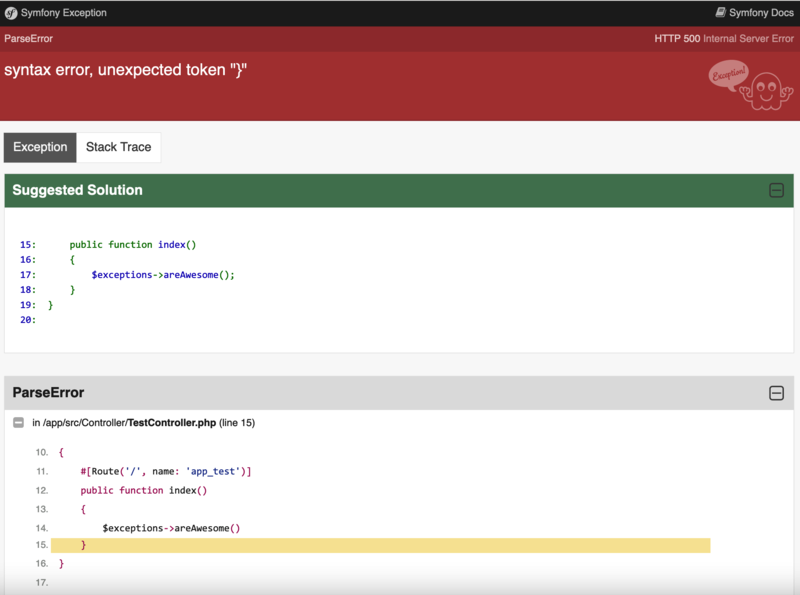

# ACSEOAIErrorExplainedBundle

This bundle improove Symfony Official Error page with an AI Suggestion to fix the error.

It relies on OpenAI and its [openai-php/client](https://github.com/openai-php/client) package, and it uses a **cache mecanism** in order to avoid calling OpenAI multiple times for the same exception.

In order to handle **ALL** exception, we will need to register a custom **Error Handler** in the Symfony Kernel. This is something that can be done with your `composer.json` file (see installation).

## Installation


```

1) Declare the Custom Error Handler in composer.json

```yaml
    ...
    "extra": {
        ...
        "runtime": {
            "error_handler": "ACSEO\\AIErrorExplainedBundle\\Runtime\\Internal\\AIErrorHandler"
        }
    }
    ...
```

2) Install the bundle using composer

```bash
composer require --dev acseo/aierrorexplained-bundle
```

3) Enable the bundle in you Symfony project (already done with Flex)

```php

<?php
// config/bundles.php

return [
    ACSEO\AIErrorExplainedBundle\ACSEOAIErrorExplainedBundle::class => ['dev' => true],
```


4) Register your OPEN AI key in `.env` file

```
# .env
OPENAI_CLIENT_KEY=sk-XXXXXX
```

5) Declare a custom Error Controller
```yaml
# config/packages/framework.yml
when@dev:
    framework:
        error_controller: ACSEO\AIErrorExplainedBundle\Controller\ErrorController::show
```

And tadaaa 🎉, you are ready to have errors !

## What you should see

<picture>
  <source media="(prefers-color-scheme: dark)" srcset="doc/ACSEOAIErrorExplainedBundle.png">
  <source media="(prefers-color-scheme: light)" srcset="doc/ACSEOAIErrorExplainedBundle.png">
  
</picture>
